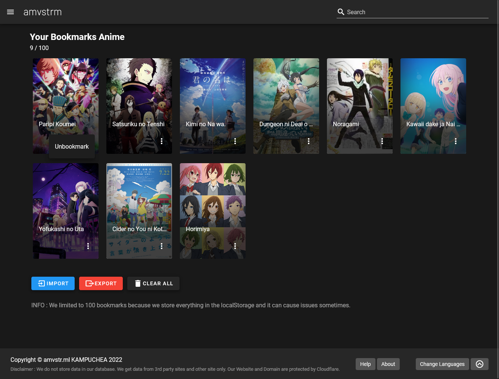

# Help

If you are having trouble with our website, this page will help you.

## Website

**Error**

Most common error code are:
- 404 Not Found
- 500 Internal Server Error

Sometime our page will displayed an error message and this will due to the API problem.  

If our page is getting 500 errors, it is most likely a problem with our server or our website. 
You should [Contact Us](mailto:admin@amvstr.ml) or make a issue on our [Github](https://github.com/amvstrm/amvstrm/issues)

**Translations**

Our website have 2 translations:
- English
- Khmer

Translations will help our website to be more user friendly for all users. 
Especially for Khmer users.

You can contribute to our website by translating our website to your language.

[](https://localazy.com/p/amvstrm)

## Video Player

Our website have 3 main video player that you can use.

Advantages of each player are:

- No ads (except goload embed)
- Memorize the time position of the video
- Simple and Easy to use

**Plyr Embed**

For most of the time we recommend using this player. because it is the fastest, clean UI and stable.

One of the most common error messages on plyr embed are :

- Video expired. Please use newer link
- If video doesn't load, try reload or clear cache

If these error messages are present, Try to reload the page or clear the browser cache.

> _If you are using our bookmarking service, 
please export your bookmarking data before clearing the browser data_ 
_We are not responsible for the data_

- Your browser not support HLS. please update your browser

Plyr HLS only supports most of the modern browsers available. 
Please update your browser in order to use it.

**nsPlayer**

nsPlayer is stable and legacy player that can be used if plyr js didn't work.
nsPlayer provided do the same features as plyr js.

One of the most common error messages on nsPlayer are :

- manifestLoadError (network error)

Try to reload the page or clear the browser cache.

- Failed to open media
- No video URL found

It mean that the url of the content isn't valid or the content url from cdn have been changed or deleted.
Try to switch to other player if that happens.

**Goload (ADs)**

Goload is the main player for gogoanime. Goload have 5 different player for different services.

- Vidstreaming/Gogostream
- StreamSB
- Doodstream
- XtreamCDN
- Mp4upload

If any of other no ads player is not working, use goload instead.

If you want to use goload without any ads,
We recommend using Ad Blocker Extension or Enable Sandbox mode.  
_Sandbox mode only works with Firefox and Doesn't work with Chromium browser_

## Bookmark



Bookmarking is a great way to save your favorite anime and
our website have its own bookmarking tool to bookmarked your anime locally.

You can manage the bookmarking data from amvstr.ml/bookmarks and start using it.

**How to use bookmark**

1. Go to any anime pages
2. Click bookmark button
3. Go to Bookmark page from the sidebar
4. Done

If you want to remove one anime from your bookmarks,
you can do it from the bookmark page or on anime page by clicking on the unbookmark button.

**Limitation**

- Bookmarking data is stored in your browser. Once you clear the browser data, you will lose your bookmarking data.
  We recommend you try to export your bookmarking data before clearing the browser data.

- Store only 100 bookmarks. If your browser have some issue with storing data, it will be possibly deleted by the browser itself.

- If your bookmarking data is corrupted or modified, you will not be able to access your bookmarking data.

**Why not use cloud way?**

Cloud storage is a great way to store your data but
it required us to spend a lot of money to set up (authentication service, storage, etc).

We are planing to use cloud storage in the future but we are not sure yet.

**Modifying your bookmarking data and Understanding each data**

If you want to modify your bookmarking data, you can use our tool [Here](https://editbookmark.amvstr.ml).

```code
{
  "amv_val_str":"AMVSTRM_BOOKMARK_DATA_DO_NOT_TOUCH",
  "info":"WARNING MESSAGE",
  "time": UNIX TIME,
  "bookmarks":[
    ALL YOUR DATA
  ]
}
```

Each export bookmarks data will be in json format. 
You will be see those data once you export.

- amv_val_str is the most important string that will check if your data does contain amvstrm bookmark data.
if the string didnt present in your data, it will be considered as corrupted data or modified.

- info is a warning message that will be displayed to you warning not to modify your data.

- time is the time when you export your data.

- bookmarks is the data that you save in your browser.

If you modify have the duplicate data, it will append to the existing data.
